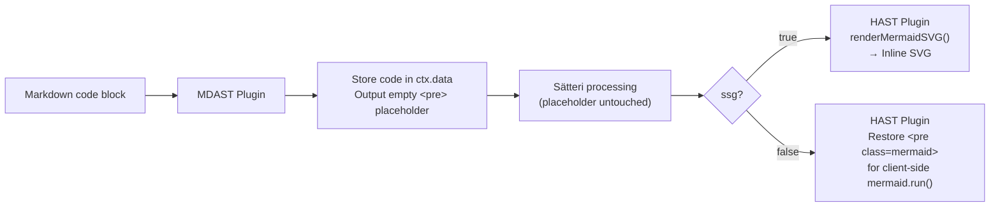

# @xingwangzhe/satteri-mermaid

> Sätteri MDAST + HAST plugin for Mermaid diagram detection and SSG SVG rendering.
> **v0.3.2: zero client JS — diagrams rendered at build time.**

## Features

- **SSG SVG rendering** — `ssg: true` (default) renders diagrams as static inline SVG at build time via [`beautiful-mermaid`](https://github.com/lukilabs/beautiful-mermaid). No client-side `mermaid.js` required.
- **Theme-adaptive** — default colors use CSS variables (`var(--card-bg)`, `var(--muted-text)`). Pass your own variables for automatic light/dark mode switching.
- **Auto-responsive** — `responsive: true` (default) removes fixed SVG dimensions and adds `width:100%`. Zero extra CSS.
- **Dual-plugin architecture** — MDAST plugin detects code blocks, HAST plugin renders or restores them. Immune to Sätteri text transforms.
- **Feature detection** — `popFlags()` returns `{ hasMermaid: boolean }` per document.
- **TypeScript** — fully typed with exported interfaces.

## Install

```bash
bun add -D @xingwangzhe/satteri-mermaid beautiful-mermaid
```

Requires `satteri >= 0.8.0`. `mermaid` is **not needed** when using `ssg: true`.

## Usage

```js
// astro.config.mjs
import { defineConfig } from "astro/config";
import { satteri } from "@astrojs/markdown-satteri";
import { katex } from "@nullpinter/satteri-katex";
import { photoswipe } from "@xingwangzhe/satteri-photoswipe";
import { mermaidMdast, mermaidHast } from "@xingwangzhe/satteri-mermaid";

export default defineConfig({
  markdown: {
    processor: satteri({
      mdastPlugins: [katex(), mermaidMdast()],
      hastPlugins: [
        photoswipe(),
        mermaidHast({
          ssg: true,               // default: true — build-time static SVG
          responsive: true,        // default: true — auto width:100%
          svgOptions: {
            bg: "var(--card-bg, #1a1b26)",     // CSS variable with fallback
            fg: "var(--muted-text, #a9b1d6)",  // CSS variable with fallback
            line: "var(--accent, #58a6ff)",     // optional — edge/connector color
            accent: "var(--accent, #58a6ff)",   // optional — arrows, highlights
            muted: "var(--muted, #8b949e)",     // optional — edge labels, secondary text
            surface: "var(--surface, #0d1117)", // optional — node fill
            border: "var(--border, #30363d)",   // optional — node/group borders
            font: "inherit",                    // optional — font family
            padding: 40,                        // default: 40 — canvas padding (px)
            nodeSpacing: 24,                    // default: 24 — horizontal gap (px)
            layerSpacing: 40,                   // default: 40 — vertical gap (px)
          },
        }),
        // Legacy client-side: mermaidHast({ ssg: false })
      ],
    }),
  },
});
```

## Options

### `MermaidPluginOptions`

| Option | Type | Default | Description |
|--------|------|---------|-------------|
| `ssg` | `boolean` | `true` | Build-time SVG rendering |
| `responsive` | `boolean` | `true` | Auto `width:100%;display:block` on SVG, `max-width:100%;overflow:hidden` on wrapper |
| `langs` | `string[]` | `["mermaid"]` | Code block language identifiers to match |

### `svgOptions` — Colors

All color values accept CSS variables (e.g. `var(--card-bg)`) with an optional fallback after comma.

| Option | Default | Controls |
|--------|---------|----------|
| `bg` | `var(--card-bg, #1a1b26)` | Canvas background |
| `fg` | `var(--muted-text, #a9b1d6)` | Node labels, primary text |
| `line` | — | Edge lines / connectors |
| `accent` | — | Arrow heads, highlighted nodes |
| `muted` | — | Edge labels, secondary text |
| `surface` | — | Node fill / box interior |
| `border` | — | Node and group borders |

### `svgOptions` — Layout

| Option | Type | Default | Description |
|--------|------|---------|-------------|
| `font` | `string` | — | Font family (e.g. `"inherit"`) |
| `padding` | `number` | `40` | Canvas padding (px) |
| `nodeSpacing` | `number` | `24` | Horizontal spacing between nodes (px) |
| `layerSpacing` | `number` | `40` | Vertical spacing between layers (px) |

## How It Works



## API

### Factory Functions

| Function | Returns | Register in |
|----------|---------|-------------|
| `mermaidMdast(options?)` | `MdastPluginDefinition` | `mdastPlugins` |
| `mermaidHast(options?)` | `HastPluginDefinition` | `hastPlugins` |
| `createMermaidMdastPlugin(options?)` | `{ plugin, popFlags }` | `mdastPlugins` + detection |
| `createMermaidHastPlugin(options?)` | `{ plugin }` | `hastPlugins` |

### Feature Detection

```ts
import { createMermaidMdastPlugin, createMermaidHastPlugin } from "@xingwangzhe/satteri-mermaid";

const { plugin: mdast, popFlags } = createMermaidMdastPlugin();
const { plugin: hast } = createMermaidHastPlugin({ ssg: true });

// After processing:
const { hasMermaid } = popFlags(); // { hasMermaid: boolean }
```

### Deprecated (v0.1.x compatibility)

| Export | Replacement |
|--------|-------------|
| `mermaid()` | `mermaidMdast()` |
| `mermaidPlugin` | `mermaidMdast()` |
| `popFlags` (global) | `createMermaidMdastPlugin().popFlags` |
| `createMermaidPlugin()` | `createMermaidMdastPlugin()` |

## Migration

### v0.2.x → v0.3.0

1. Update to `>= 0.3.0`. Install `beautiful-mermaid` as a dependency.

2. **Remove** client-side mermaid script from your Astro component:
```diff
- {props.hasMermaid && (
-   <script>
-     import mermaid from "mermaid";
-     mermaid.initialize({ startOnLoad: false, theme: "dark" });
-     document.addEventListener("astro:page-load", () => {
-       mermaid.run({ querySelector: ".mermaid" });
-     });
-   </script>
- )}
```

3. Remove `mermaid` from `package.json` if no longer used elsewhere.

4. Diagrams now render at build time with auto-responsive width — zero client JS, zero extra CSS.

## Example

```bash
git clone https://github.com/xingwangzhe/satteri-mermaid.git
cd satteri-mermaid/example
bun install
bun run build   # → dist/index.html with inline SVGs
```

## License

MIT
