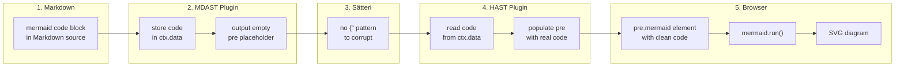

# @xingwangzhe/satteri-mermaid

> Sätteri MDAST + HAST plugin for Mermaid diagram detection and transformation.

## Features

- **Dual-plugin architecture** — MDAST plugin for detection, HAST plugin for safe rendering
- **Immune to Sätteri text transforms** — mermaid code is inserted *after* Sätteri processing, so `{"` diamond nodes survive
- **Zero-config** — `mermaidMdast()` + `mermaidHast()` just work
- **Feature detection** — `popFlags()` tells you whether the page has diagrams, so you can lazy-load mermaid
- **Isolated instances** — each factory call returns an independent plugin instance
- **TypeScript** — fully typed

## Install

```bash
bun add @xingwangzhe/satteri-mermaid
```

Requires `satteri >= 0.8.0` and `mermaid >= 11.0.0` as peer dependencies.

## Usage

### Recommended (MDAST + HAST, since v0.2.0)

```js
// astro.config.mjs
import { mermaidMdast, mermaidHast } from "@xingwangzhe/satteri-mermaid";

export default defineConfig({
  markdown: {
    processor: satteri({
      mdastPlugins: [katex(), mermaidMdast()],
      hastPlugins: [photoswipe(), mermaidHast()],
    }),
  },
});
```

### Why MDAST + HAST?

Sätteri applies text transformations (like converting `{"` to curly-quote equivalents) to **all raw HTML content** produced by MDAST plugins. This corrupts mermaid diamond-node syntax (`C{"label"}` → `C{'{'}"label"{'}'}`), causing browser-side "Syntax error".

The solution: the MDAST plugin only outputs an empty `<pre class="mermaid">` placeholder and stores the mermaid code in `ctx.data`. The HAST plugin runs **after** all Sätteri processing is complete, reads the code from `ctx.data`, and populates the `<pre>` element — safely bypassing any text transforms. See [How It Works](#how-it-works) for a visual overview.

### Advanced (with feature detection)

```ts
import { createMermaidMdastPlugin, createMermaidHastPlugin } from "@xingwangzhe/satteri-mermaid";

const { plugin: mdastPlugin, popFlags } = createMermaidMdastPlugin({ langs: ["mermaid"] });
const { plugin: hastPlugin } = createMermaidHastPlugin();

// Register plugins:
//   mdastPlugins: [mdastPlugin],
//   hastPlugins:  [hastPlugin],

// After processing:
const { hasMermaid } = popFlags();
if (hasMermaid) {
  await import("mermaid");
  mermaid.run({ querySelector: ".mermaid" });
}
```

## How It Works



## API

### `mermaidMdast(options?)`

Factory function. Returns a Sätteri **MDAST** plugin. Register in `mdastPlugins`.

### `mermaidHast(options?)`

Factory function. Returns a Sätteri **HAST** plugin. Register in `hastPlugins`.

### Shared Options

| Option  | Type       | Default       | Description                     |
| ------- | ---------- | ------------- | ------------------------------- |
| `langs` | `string[]` | `["mermaid"]` | Code block language identifiers |

### `createMermaidMdastPlugin(options?)`

Returns `{ plugin, popFlags }`. Use this when you need `popFlags` for feature detection.

### `createMermaidHastPlugin(options?)`

Returns `{ plugin }`. Companion HAST plugin for the MDAST one above.

### `popFlags(): MermaidFlags`

Returns `{ hasMermaid: boolean }` and resets internal state.

## Migration (v0.1.x → v0.2.0)

**Before:**

```js
import { mermaid } from "@xingwangzhe/satteri-mermaid";

mdastPlugins: [katex(), mermaid()],
```

**After:**

```js
import { mermaidMdast, mermaidHast } from "@xingwangzhe/satteri-mermaid";

mdastPlugins: [katex(), mermaidMdast()],
hastPlugins: [photoswipe(), mermaidHast()],
```

If you use `createMermaidPlugin()` + `popFlags()`:

```diff
- import { createMermaidPlugin } from "@xingwangzhe/satteri-mermaid";
- const { plugin, popFlags } = createMermaidPlugin();
+ import { createMermaidMdastPlugin, createMermaidHastPlugin } from "@xingwangzhe/satteri-mermaid";
+ const { plugin: mdastPlugin, popFlags } = createMermaidMdastPlugin();
+ const { plugin: hastPlugin } = createMermaidHastPlugin();
```

> **Note:** `mermaid()` and `mermaidPlugin` are still available as deprecated aliases. They only return the MDAST plugin and do **not** protect against Sätteri text transforms. Migrate to the dual-plugin approach for correct rendering.

## Development

```bash
bun install
bun run build   # vite build + tsc → dist/
bun run test    # vitest
bun run lint    # oxlint
bun run fmt     # oxfmt
```

## License

MIT
