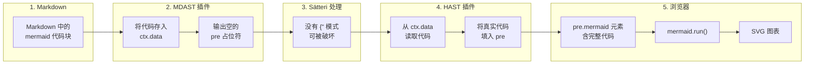

# @xingwangzhe/satteri-mermaid

[English](README.md) | [中文文档](#)

> Sätteri MDAST + HAST 双插件：检测并安全渲染 Mermaid 图表代码块

## 特性

- **双插件架构** — MDAST 插件负责检测，HAST 插件负责安全渲染
- **免疫 Sätteri 文本转换** — mermaid 代码在 Sätteri 处理**之后**才插入，`{"` 菱形节点不会被破坏
- **零配置** — `mermaidMdast()` + `mermaidHast()` 开箱即用
- **特性检测** — `popFlags()` 告诉你当前页面是否包含图表，方便按需加载 mermaid 库
- **实例隔离** — 每次工厂函数调用返回独立插件实例
- **TypeScript** — 全类型安全

## 安装

```bash
bun add @xingwangzhe/satteri-mermaid
```

需要 `satteri >= 0.8.0` 和 `mermaid >= 11.0.0` 作为 peer dependencies。

## 使用

### 推荐用法（MDAST + HAST，v0.2.0 起）

```js
// astro.config.mjs
import { mermaidMdast, mermaidHast } from "@xingwangzhe/satteri-mermaid";

export default defineConfig({
  markdown: {
    processor: satteri({
      mdastPlugins: [katex(), mermaidMdast()],
      hastPlugins: [photoswipe(), mermaidHast()],
    }),
  },
});
```

### 为什么需要 MDAST + HAST？

Sätteri 会对其产生的**所有 raw HTML 内容**应用文本转换（例如把 `{"` 转换为弯引号形式）。这会破坏 mermaid 菱形节点语法（`C{"标签"}` → `C{'{'}"标签"{'}'}`），导致浏览器端报 "Syntax error"。

解决方案：MDAST 插件只输出一个空的 `<pre class="mermaid">` 占位符，并将 mermaid 代码存入 `ctx.data`。HAST 插件在**所有 Sätteri 处理完成之后**运行，从 `ctx.data` 读取代码并填入 `<pre>` 元素——安全绕过所有文本转换。详见[工作原理](#工作原理)。

### 高级用法（配合特性检测）

```ts
import { createMermaidMdastPlugin, createMermaidHastPlugin } from "@xingwangzhe/satteri-mermaid";

const { plugin: mdastPlugin, popFlags } = createMermaidMdastPlugin({ langs: ["mermaid"] });
const { plugin: hastPlugin } = createMermaidHastPlugin();

// 注册插件：
//   mdastPlugins: [mdastPlugin],
//   hastPlugins:  [hastPlugin],

// 处理后：
const { hasMermaid } = popFlags();
if (hasMermaid) {
  await import("mermaid");
  mermaid.run({ querySelector: ".mermaid" });
}
```

## 工作原理



## API

### `mermaidMdast(options?)`

工厂函数，返回 Sätteri **MDAST** 插件。注册到 `mdastPlugins`。

### `mermaidHast(options?)`

工厂函数，返回 Sätteri **HAST** 插件。注册到 `hastPlugins`。

### 共享参数

| 参数    | 类型       | 默认值         | 说明             |
| ------- | ---------- | -------------- | ---------------- |
| `langs` | `string[]` | `["mermaid"]`  | 匹配的代码块语言 |

### `createMermaidMdastPlugin(options?)`

返回 `{ plugin, popFlags }`。需要 `popFlags` 做特性检测时使用。

### `createMermaidHastPlugin(options?)`

返回 `{ plugin }`。配套的 HAST 插件。

### `popFlags(): MermaidFlags`

返回 `{ hasMermaid: boolean }` 并重置内部状态。

## 迁移指南（v0.1.x → v0.2.0）

**之前：**

```js
import { mermaid } from "@xingwangzhe/satteri-mermaid";

mdastPlugins: [katex(), mermaid()],
```

**之后：**

```js
import { mermaidMdast, mermaidHast } from "@xingwangzhe/satteri-mermaid";

mdastPlugins: [katex(), mermaidMdast()],
hastPlugins: [photoswipe(), mermaidHast()],
```

如果使用了 `createMermaidPlugin()` + `popFlags()`：

```diff
- import { createMermaidPlugin } from "@xingwangzhe/satteri-mermaid";
- const { plugin, popFlags } = createMermaidPlugin();
+ import { createMermaidMdastPlugin, createMermaidHastPlugin } from "@xingwangzhe/satteri-mermaid";
+ const { plugin: mdastPlugin, popFlags } = createMermaidMdastPlugin();
+ const { plugin: hastPlugin } = createMermaidHastPlugin();
```

> **注意：** `mermaid()` 和 `mermaidPlugin` 仍然可用，但已标记为 deprecated。它们仅返回 MDAST 插件，**不能**防止 Sätteri 文本转换破坏 mermaid 代码。请迁移到双插件方案以获得正确的渲染。

## 开发

```bash
bun install
bun run build   # vite build + tsc → dist/
bun run test    # vitest
bun run lint    # oxlint
bun run fmt     # oxfmt
```

## 许可

MIT
