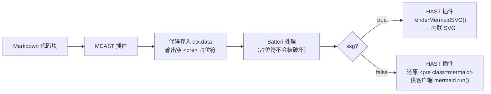

# @xingwangzhe/satteri-mermaid

[English](README.md) | 中文文档

> Sätteri MDAST + HAST 双插件：检测 Mermaid 图表并以 SSG 方式渲染为静态 SVG。
> **v0.3.2: 零客户端 JS — 构建时渲染图表。**

## 特性

- **SSG SVG 渲染** — `ssg: true`（默认）通过 [`beautiful-mermaid`](https://github.com/lukilabs/beautiful-mermaid) 在构建时将图表渲染为静态内联 SVG。**无需客户端 `mermaid.js`。**
- **自适应主题** — 默认颜色使用 CSS 变量（`var(--card-bg)`、`var(--muted-text)`），传入自己的变量即可自动跟随明暗主题切换。
- **自动响应式** — `responsive: true`（默认）自动移除 SVG 固定宽高并添加 `width:100%`，无需手写 CSS。
- **双插件架构** — MDAST 插件检测代码块，HAST 插件渲染或还原。免疫 Sätteri 文本变换，`{"` 节点不会被破坏。
- **特性检测** — `popFlags()` 返回 `{ hasMermaid: boolean }`，可按文档判断是否包含图表。
- **TypeScript** — 完整类型定义，导出 `MermaidPluginOptions` 和 `MermaidFlags` 接口。

## 安装

```bash
bun add -D @xingwangzhe/satteri-mermaid beautiful-mermaid
```

依赖 `satteri >= 0.8.0`。使用 `ssg: true` 时**不需要**安装 `mermaid`。

## 使用

```js
// astro.config.mjs
import { defineConfig } from "astro/config";
import { satteri } from "@astrojs/markdown-satteri";
import { katex } from "@nullpinter/satteri-katex";
import { photoswipe } from "@xingwangzhe/satteri-photoswipe";
import { mermaidMdast, mermaidHast } from "@xingwangzhe/satteri-mermaid";

export default defineConfig({
  markdown: {
    processor: satteri({
      mdastPlugins: [katex(), mermaidMdast()],
      hastPlugins: [
        photoswipe(),
        mermaidHast({
          ssg: true,               // 默认 true — 构建时静态 SVG
          responsive: true,        // 默认 true — 自动 width:100%
          svgOptions: {
            bg: "var(--card-bg, #1a1b26)",     // CSS 变量 + 回退值
            fg: "var(--muted-text, #a9b1d6)",  // CSS 变量 + 回退值
            line: "var(--accent, #58a6ff)",     // 可选 — 连线/连接器颜色
            accent: "var(--accent, #58a6ff)",   // 可选 — 箭头、高亮节点
            muted: "var(--muted, #8b949e)",     // 可选 — 边标签、次要文字
            surface: "var(--surface, #0d1117)", // 可选 — 节点填充
            border: "var(--border, #30363d)",   // 可选 — 节点/分组边框
            font: "inherit",                    // 可选 — 字体
            padding: 40,                        // 默认 40 — 画布内边距(px)
            nodeSpacing: 24,                    // 默认 24 — 水平间距(px)
            layerSpacing: 40,                   // 默认 40 — 垂直间距(px)
          },
        }),
        // 传统客户端渲染: mermaidHast({ ssg: false })
      ],
    }),
  },
});
```

## 选项

### `MermaidPluginOptions`

| 选项 | 类型 | 默认值 | 说明 |
|--------|------|---------|------|
| `ssg` | `boolean` | `true` | 构建时 SVG 渲染 |
| `responsive` | `boolean` | `true` | SVG 自动 `width:100%;display:block`，外层 `max-width:100%;overflow:hidden` |
| `langs` | `string[]` | `["mermaid"]` | 要匹配的代码块语言标识符 |

### `svgOptions` — 图表配色

所有颜色值均支持 CSS 变量（如 `var(--card-bg)`），逗号后为变量未定义时的回退色值。

| 选项 | 默认值 | 控制元素 |
|--------|---------|----------|
| `bg` | `var(--card-bg, #1a1b26)` | 画布背景 |
| `fg` | `var(--muted-text, #a9b1d6)` | 节点标签、主文字 |
| `line` | — | 连线 / 连接器 |
| `accent` | — | 箭头、高亮节点 |
| `muted` | — | 边标签、次要文字 |
| `surface` | — | 节点填充 / 盒内部 |
| `border` | — | 节点和分组边框 |

### `svgOptions` — 布局

| 选项 | 类型 | 默认值 | 说明 |
|--------|------|---------|------|
| `font` | `string` | — | 字体（如 `"inherit"`） |
| `padding` | `number` | `40` | 画布内边距（px） |
| `nodeSpacing` | `number` | `24` | 节点水平间距（px） |
| `layerSpacing` | `number` | `40` | 层级垂直间距（px） |

## 工作原理



## API

### 工厂函数

| 函数 | 返回值 | 注册到 |
|----------|---------|-------------|
| `mermaidMdast(options?)` | `MdastPluginDefinition` | `mdastPlugins` |
| `mermaidHast(options?)` | `HastPluginDefinition` | `hastPlugins` |
| `createMermaidMdastPlugin(options?)` | `{ plugin, popFlags }` | `mdastPlugins` + 检测 |
| `createMermaidHastPlugin(options?)` | `{ plugin }` | `hastPlugins` |

### 特性检测

```ts
import { createMermaidMdastPlugin, createMermaidHastPlugin } from "@xingwangzhe/satteri-mermaid";

const { plugin: mdast, popFlags } = createMermaidMdastPlugin();
const { plugin: hast } = createMermaidHastPlugin({ ssg: true });

// 处理完成后：
const { hasMermaid } = popFlags(); // { hasMermaid: boolean }
```

### 已废弃（v0.1.x 兼容）

| 导出 | 替代 |
|--------|-------------|
| `mermaid()` | `mermaidMdast()` |
| `mermaidPlugin` | `mermaidMdast()` |
| `popFlags` (全局) | `createMermaidMdastPlugin().popFlags` |
| `createMermaidPlugin()` | `createMermaidMdastPlugin()` |

## 迁移指南

### v0.2.x → v0.3.0

1. 升级到 `>= 0.3.0`，安装 `beautiful-mermaid` 依赖。

2. **删除**客户端 mermaid 脚本：
```diff
- {props.hasMermaid && (
-   <script>
-     import mermaid from "mermaid";
-     mermaid.initialize({ startOnLoad: false, theme: "dark" });
-     document.addEventListener("astro:page-load", () => {
-       mermaid.run({ querySelector: ".mermaid" });
-     });
-   </script>
- )}
```

3. 如果其他地方不再使用，从 `package.json` 删除 `mermaid` 依赖。

4. 图表现在在构建时渲染，自适应宽度内置——零客户端 JS，零额外 CSS。

## 示例

```bash
git clone https://github.com/xingwangzhe/satteri-mermaid.git
cd satteri-mermaid/example
bun install
bun run build   # → dist/index.html（含内联 SVG）
```

## License

MIT
