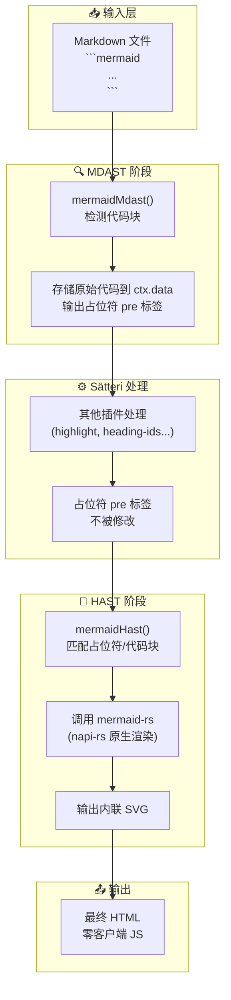
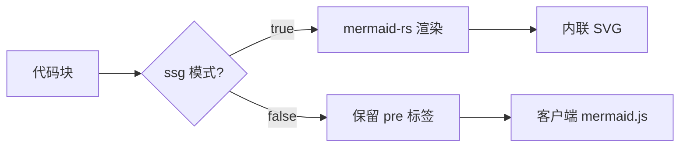

## 整体架构

Sätteri Mermaid 采用 **MDAST + HAST 双插件架构**，确保在整个 Markdown 处理流水线中，Mermaid 代码块不会被其他插件破坏：

## 核心设计原则

### 1. 免疫文本变换

MDAST 插件将原始 Mermaid 代码存储在 `ctx.data` 中，并输出一个简单的 `<pre class="mermaid" data-mermaid-id="...">` 占位符。由于 Sätteri 的其他插件（如高亮、标题 ID 等）不会修改 raw HTML 节点，代码内容得以完整保留。

### 2. SSG 优先，也可降级

### 3. 渲染器细节

`mermaid-rs` 是通过 napi-rs 编译的 Rust 原生模块，通过在 Node.js 中加载 `.node` 二进制文件调用。相比 WASM 方案，原生模块避免了 JS↔WASM 的序列化开销，单图渲染时间约 3ms。
