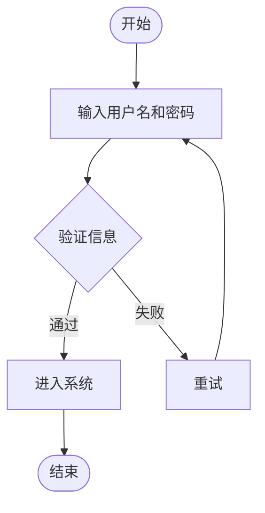
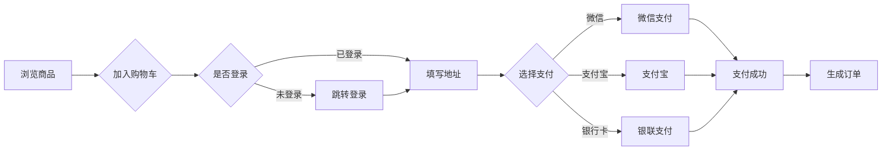
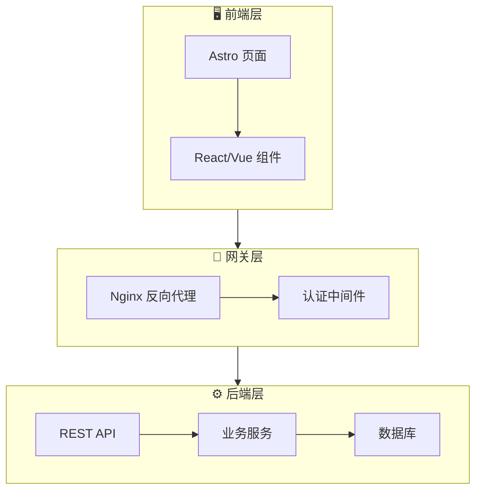
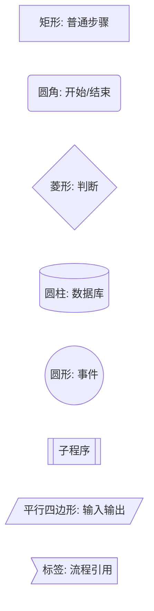

## 基础流程图

最简单的流程图，展示用户登录流程：

```mermaid
flowchart TD
    Start([开始]) --> Input[输入用户名和密码]
    Input --> Validate{验证信息}
    Validate -->|通过| Welcome[进入系统]
    Validate -->|失败| Retry[重试]
    Retry --> Input
    Welcome --> End([结束])
```

## 多分支决策

电商下单流程，包含多个决策点：

```mermaid
flowchart LR
    A[浏览商品] --> B{加入购物车}
    B --> C{是否登录}
    C -->|已登录| D[填写地址]
    C -->|未登录| E[跳转登录]
    E --> D
    D --> F{选择支付}
    F -->|微信| G[微信支付]
    F -->|支付宝| H[支付宝]
    F -->|银行卡| I[银联支付]
    G --> J[支付成功]
    H --> J
    I --> J
    J --> K[生成订单]
```

## 子图嵌套

用子图展示系统的模块划分：

```mermaid
flowchart TB
    subgraph Frontend["🖥️ 前端层"]
        direction TB
        Page["Astro 页面"]
        Component["React/Vue 组件"]
        Page --> Component
    end

    subgraph Gateway["🚪 网关层"]
        Nginx["Nginx 反向代理"]
        Auth["认证中间件"]
        Nginx --> Auth
    end

    subgraph Backend["⚙️ 后端层"]
        direction LR
        API["REST API"]
        Service["业务服务"]
        DB["数据库"]
        API --> Service --> DB
    end

    Frontend --> Gateway --> Backend
```

## 节点样式

不同类型节点的组合使用：

```mermaid
flowchart LR
    A[矩形: 普通步骤]
    B(圆角: 开始/结束)
    C{菱形: 判断}
    D[(圆柱: 数据库)]
    E((圆形: 事件))
    F[[子程序]]
    G[/平行四边形: 输入输出/]
    H>标签: 流程引用]
```
