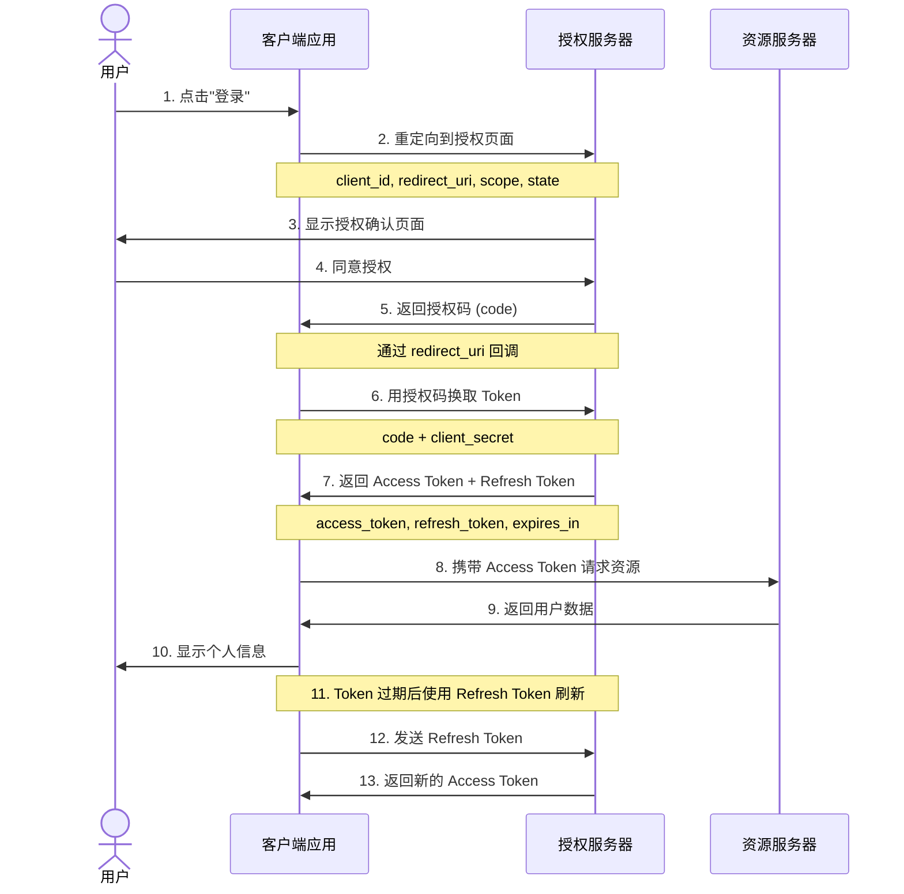

## OAuth 2.0 授权码流程

这是最安全的 OAuth 2.0 认证方式，适用于有后端服务器的应用：

## 关键安全点

| 步骤 | 安全措施 | 说明 |
|------|----------|------|
| 步骤 2 | `state` 参数 | 防止 CSRF 攻击 |
| 步骤 5-6 | 授权码一次性使用 | 防止重放攻击 |
| 步骤 6 | `client_secret` | 后端保密传输 |
| 步骤 8 | Bearer Token | 每次请求携带 |
