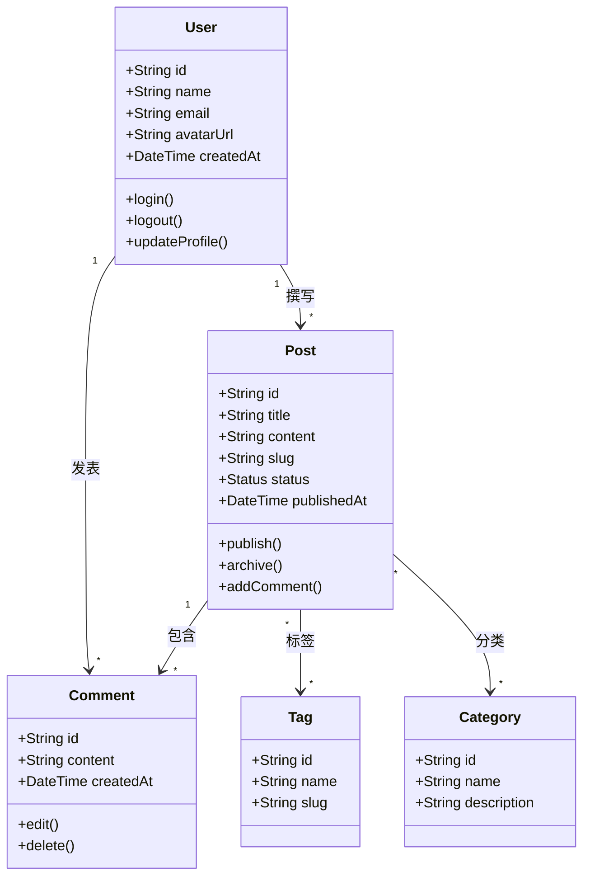
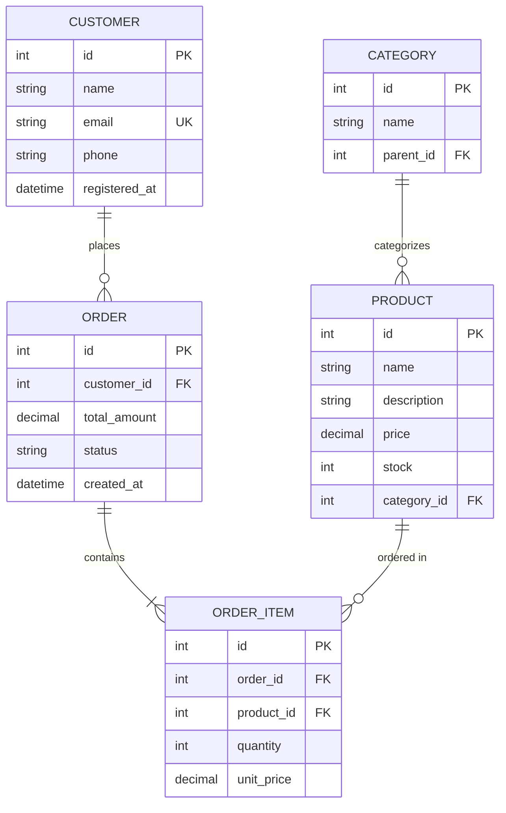

## 类图：博客系统的领域模型

```mermaid
classDiagram
    class User {
        +String id
        +String name
        +String email
        +String avatarUrl
        +DateTime createdAt
        +login()
        +logout()
        +updateProfile()
    }

    class Post {
        +String id
        +String title
        +String content
        +String slug
        +Status status
        +DateTime publishedAt
        +publish()
        +archive()
        +addComment()
    }

    class Comment {
        +String id
        +String content
        +DateTime createdAt
        +edit()
        +delete()
    }

    class Tag {
        +String id
        +String name
        +String slug
    }

    class Category {
        +String id
        +String name
        +String description
    }

    User "1" --> "*" Post : 撰写
    User "1" --> "*" Comment : 发表
    Post "1" --> "*" Comment : 包含
    Post "*" --> "*" Tag : 标签
    Post "*" --> "*" Category : 分类
```

## E-R 图：电商数据库设计

```mermaid
erDiagram
    CUSTOMER ||--o{ ORDER : places
    CUSTOMER {
        int id PK
        string name
        string email UK
        string phone
        datetime registered_at
    }

    ORDER ||--|{ ORDER_ITEM : contains
    ORDER {
        int id PK
        int customer_id FK
        decimal total_amount
        string status
        datetime created_at
    }

    ORDER_ITEM {
        int id PK
        int order_id FK
        int product_id FK
        int quantity
        decimal unit_price
    }

    PRODUCT ||--o{ ORDER_ITEM : "ordered in"
    PRODUCT {
        int id PK
        string name
        string description
        decimal price
        int stock
        int category_id FK
    }

    CATEGORY ||--o{ PRODUCT : categorizes
    CATEGORY {
        int id PK
        string name
        int parent_id FK
    }
```

关系说明：

- **一对多**：一个客户可以下多个订单
- **多对多**：通过 `ORDER_ITEM` 中间表实现订单和商品的多对多关系
- **自引用**：`CATEGORY.parent_id` 实现分类层级（如"电子产品 > 手机 > 智能手机"）
