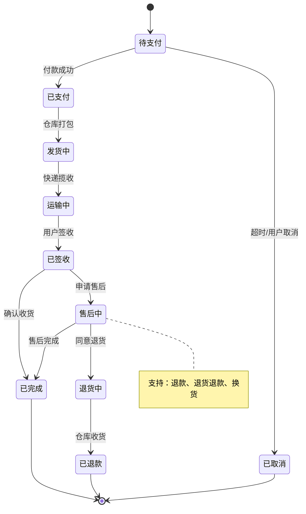
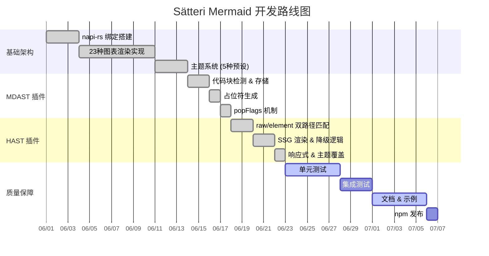
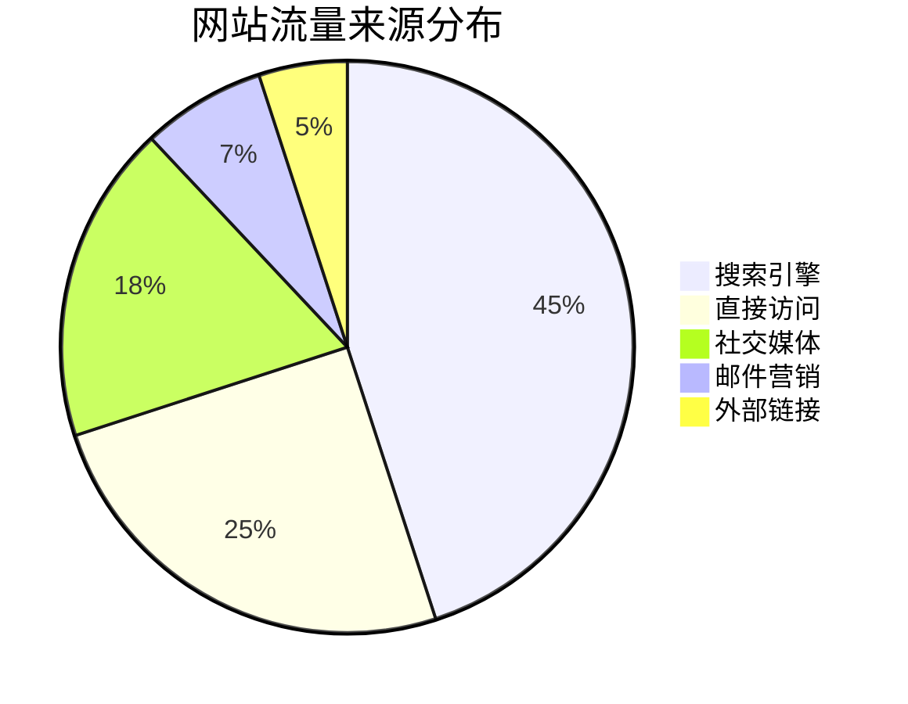
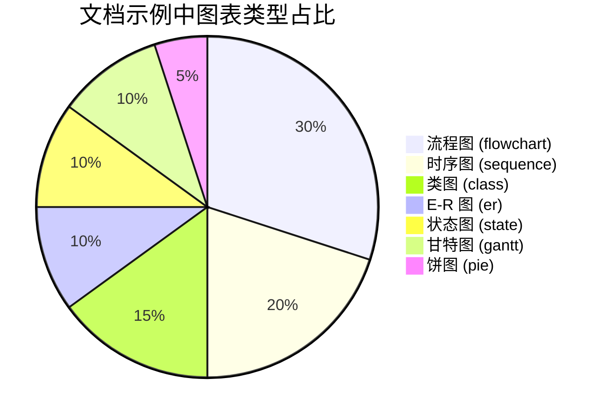

## 状态图：订单生命周期

```mermaid
stateDiagram-v2
    [*] --> 待支付
    待支付 --> 已支付 : 付款成功
    待支付 --> 已取消 : 超时/用户取消
    已支付 --> 发货中 : 仓库打包
    发货中 --> 运输中 : 快递揽收
    运输中 --> 已签收 : 用户签收
    已签收 --> 已完成 : 确认收货
    已签收 --> 售后中 : 申请售后
    售后中 --> 已完成 : 售后完成
    售后中 --> 退货中 : 同意退货
    退货中 --> 已退款 : 仓库收货
    已退款 --> [*]
    已完成 --> [*]
    已取消 --> [*]

    note right of 售后中
        支持：退款、退货退款、换货
    end note
```

## 甘特图：项目开发计划

```mermaid
gantt
    title Sätteri Mermaid 开发路线图
    dateFormat  YYYY-MM-DD
    axisFormat  %m/%d

    section 基础架构
    napi-rs 绑定搭建           :done,    a1, 2026-06-01, 3d
    23种图表渲染实现            :done,    a2, after a1, 7d
    主题系统 (5种预设)          :done,    a3, after a2, 3d

    section MDAST 插件
    代码块检测 & 存储           :done,    b1, 2026-06-14, 2d
    占位符生成                  :done,    b2, after b1, 1d
    popFlags 机制               :done,    b3, after b2, 1d

    section HAST 插件
    raw/element 双路径匹配      :done,    c1, 2026-06-18, 2d
    SSG 渲染 & 降级逻辑         :done,    c2, after c1, 2d
    响应式 & 主题覆盖           :done,    c3, after c2, 1d

    section 质量保障
    单元测试                    :active,  d1, 2026-06-23, 5d
    集成测试                    :         d2, after d1, 3d
    文档 & 示例                 :active,  d3, 2026-07-01, 5d
    npm 发布                    :         d4, after d3, 1d
```

## 饼图：网站流量来源

```mermaid
pie title 网站流量来源分布
    "搜索引擎" : 45
    "直接访问" : 25
    "社交媒体" : 18
    "邮件营销" : 7
    "外部链接" : 5
```

## 图表类型占比

这个包中我们使用最多的图表类型：

```mermaid
pie title 文档示例中图表类型占比
    "流程图 (flowchart)" : 30
    "时序图 (sequence)" : 20
    "类图 (class)" : 15
    "E-R 图 (er)" : 10
    "状态图 (state)" : 10
    "甘特图 (gantt)" : 10
    "饼图 (pie)" : 5
```
