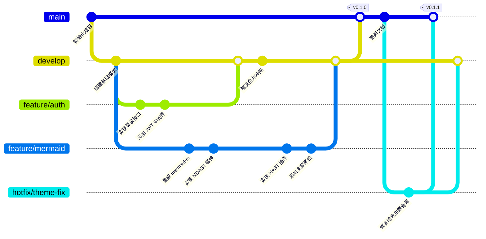
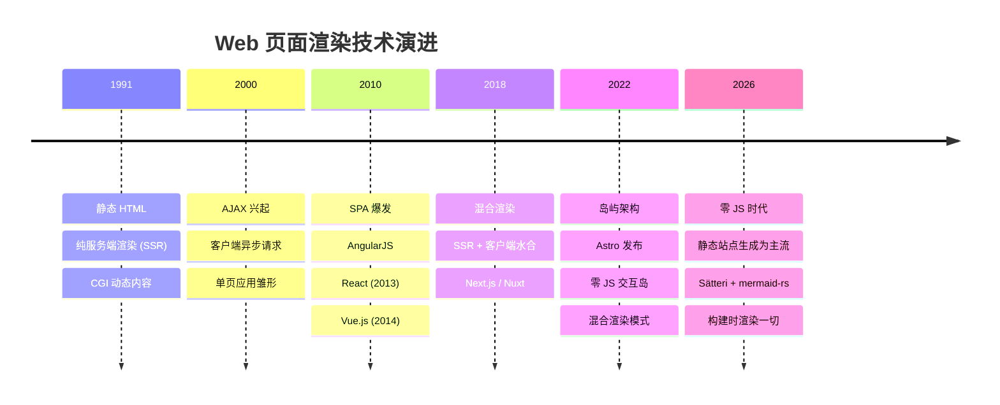

## Git 分支图：Git Flow 工作流



## 思维导图：前端知识体系

```mermaid
mindmap
  root((前端开发))
    HTML
      语义化标签
      表单元素
      SEO 基础
    CSS
      布局
        Flexbox
        Grid
      动画
        CSS Animation
        Web Animations API
      预处理器
        Sass
        PostCSS
    JavaScript
      核心概念
        闭包
        原型链
        事件循环
      ES6+
        Promise
        async/await
        模块化
      TypeScript
        类型系统
        泛型
    ::((
    框架生态
      Astro
        岛屿架构
        Sätteri 插件
      React
        Hooks
        Server Components
      Vue
        组合式 API
        Pinia
    :)))
    工程化
      构建工具
        Vite
        Turbopack
      包管理
        npm
        pnpm
      代码质量
        ESLint
        Prettier
```

## 时间线：Web 渲染技术演进


