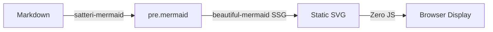
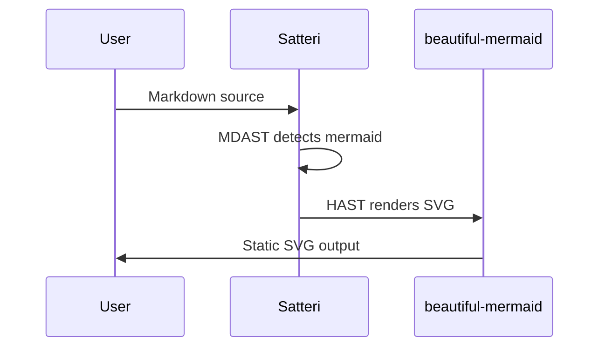
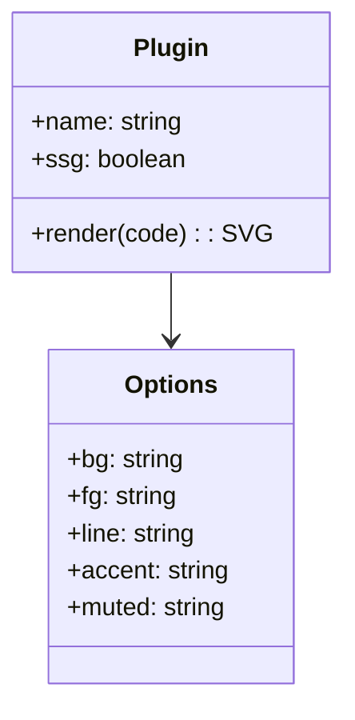
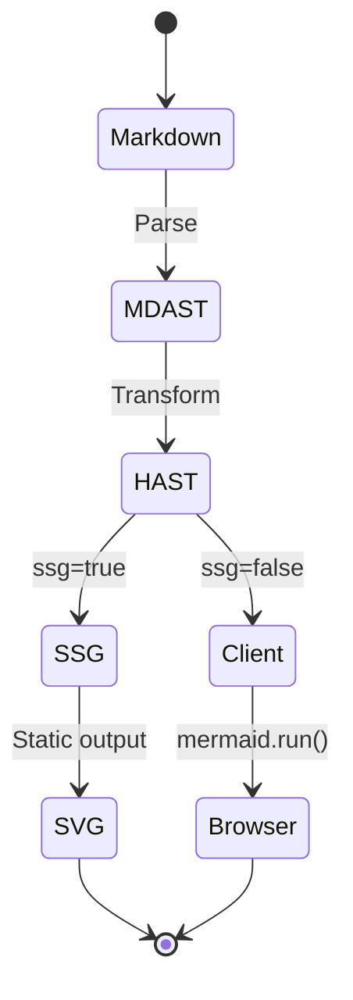

All diagrams below are **static SVGs** rendered at build time.
Zero client-side JS. Click the theme button to see dark/light adaptation.

## Flowchart

## Sequence Diagram

## Class Diagram

## State Diagram

